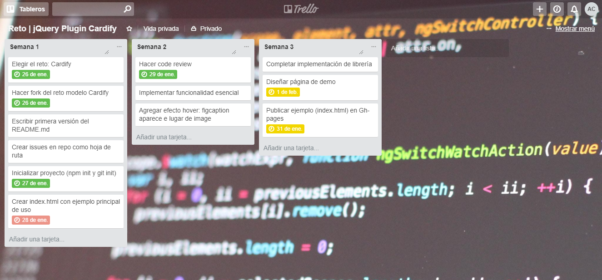
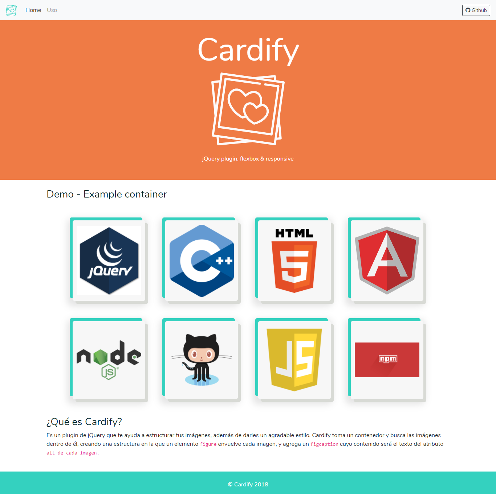
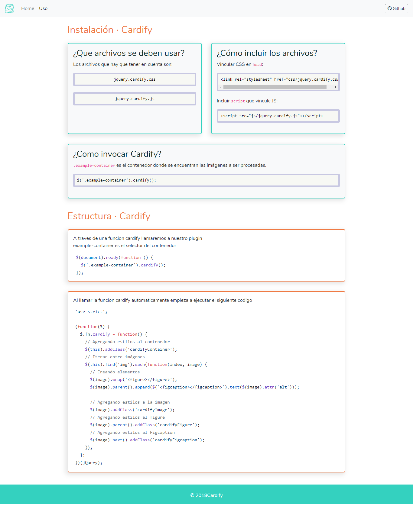

# Cardify

**Cardify** es un plugin de jQuery, flexbox y responsive. Dado un _contenedor de imágenes_, Cardify envuelve cada una de ellas en un nuevo elemento `<figure>` y añade un `<figcaption>` con el texto del atributo `alt` de la imagen.

## Flujo de trabajo

Para el desarrollo de este plugin, nos organizamos mediante la herramienta **Trello**. Además, utilizamos **issues**, los cuales figuran en este repositorio.



[Ir a board de Trello](https://trello.com/b/v9PCgmS2/reto-jquery-plugin-cardify)

## Guía de uso

### Instalación

Para poder usar **Cardify** debemos incluir dos archivos en el proyecto.

1. `jquery.cardify.css` en los que se incluyen los estilos necesarios para el funcionamiento correcto del plugin.

```html
<head>
  <meta charset="UTF-8">
  <meta name="viewport" content="width=device-width, initial-scale=1.0">
  <meta http-equiv="X-UA-Compatible" content="ie=edge">

  <!-- Ejemplo de vinculación de jquery.cardify.css -->
  <link rel="stylesheet" href="css/jquery.cardify.css">

  <title>Prueba Cardify</title>
</head>
```
2. `jquery.cardify.js` que aplicará la funcionalidad del plugin.

```html
<body>
  ...

  <!-- Ejemplo de vinculación del archivo JS -->
  <script src="ruta-del-archivo/jquery.cardify.js"></script>
</body>
```

### Uso

La estructura inicial HTML a trabajar sería la siguiente: un contenedor que envuelva a las imágenes.

```html
<section class="example-container">
  
  
  
  
  
  
</section>
```

Para que **Cardify** empiece a funcionar, debemos agregar la siguiente línea de código al archivo Javascript del proyecto.

```js
//example-container es el selector del contenedor 
$('.example-container').cardify();
```
De esta manera, se estructurará el contenido de `.example-container`, envolviendo cada imagen en un `figure` y añadiendo el `figcaption` con el texto del atributo `alt` de cada imagen.

La estructura HTML del contenedor quedará de la siguiente manera.

```html
<section class="example-container cardifyContainer">
  <figure class="cardifyFigure">
    
    <figcaption class="cardifyFigcaption">Example image 1</figcaption>
  </figure>
  <figure class="cardifyFigure">
    
    <figcaption class="cardifyFigcaption">Example image 2</figcaption>
  </figure>
  <figure class="cardifyFigure">
    
    <figcaption class="cardifyFigcaption">Example image 3</figcaption>
  </figure>
  <figure class="cardifyFigure">
    
    <figcaption class="cardifyFigcaption">Example image 4</figcaption>
  </figure>
  <figure class="cardifyFigure">
    
    <figcaption class="cardifyFigcaption">Example image 5</figcaption>
  </figure>
  <figure class="cardifyFigure">
    
    <figcaption class="cardifyFigcaption">Example image 6</figcaption>
  </figure>
</section>
```

## [Demo Cardify](https://nefelijm.github.io/cardify/public/)



